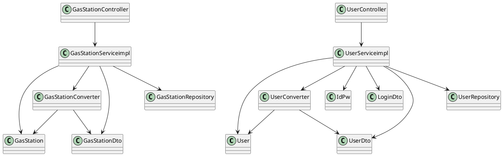

# Integration and API Test Documentation

Authors: Atabay Heydarli, Davide Lo Bianco, Gianluca Canitano, Nadir Casciola

Date: 26/5/2020

Version: 1.0

# Contents

- [Dependency graph](#dependency-graph)

- [Integration approach](#integration-approach)

- [Tests](#tests)

- [Scenarios](#scenarios)

- [Coverage of scenarios and FR](#coverage-of-scenarios-and-fr)
- [Coverage of non-functional requirements](#coverage-of-non-functional-requirements)

# Dependency graph 

     
# Integration approach

The general approach used is bottom up.
 
 Step 1: 
 * **GasStation**
 * **User**
 * **GasStationDto**
 * **UserDto**
 
 Step 2:
   * GasStation + GasStationDto + **GasStationCoverter**
   * User + UserDto + **UserConverter**

Step 3:
* GasStation + GasStationDto + GasStationConverter + **GasStationServiceimpl**
* User + UserDto + UserConverter + **UserServiceimpl**

#  Tests

## Step 1
| Classes  | JUnit test cases |
|--|--|
|GasStation|TestgetGasStationId1()|
||TestgetGasStationId2()|
||TestgetDieselPrice1()|
||TestgetDieselPrice2()|
||TestgetDieselPrice3()|
||TestgetDieselPrice4()|
||TestsetGasPrice1()|
||TestsetGasPrice2()|
||TestsetGasPrice3()|
||TestsetGasPrice4()|
||TestsetGasPrice5()|
|User|TestgetUserId1()|
||TestgetUserId2()|
||TestgetReputation1()|
||TestgetReputation2()|
||TestgetAdmin1()|
||TestgetAdmin2()|

## Step 2
| Classes  | JUnit test cases |
|--|--|
|User + UserDto + UserConverter|adminUserToDtoTest()|
||normalUserToDtoTest()|
||adminUserDtoToUserTest()|
||normalUserDtoToUserTest()|
|GasStation + GasStationDto + GasStationCoverter|gasStationToDtoTest()|
||dtoToGasStationTest()|

## Step 3 API Tests

| Classes  | JUnit test cases |
|--|--|
|User + UserDto + UserConverter + UserServiceimpl|getUserByIdExceptionTest()|
||getUserByIdNullTest()|
||getUserByIdTest()|
||getAllUsersTest()|
||getAllUsersEmptyTest()|
||deleteUserExceptionTest()|
||deleteUserTest()|
||deleteNonExistingUserTest()|
||loginSuccessfulTest()|
||loginWrongPwdTest()|
||loginWrongEmailTest()|
||increaseReputationTest()|
||increaseReputationMaximumTest()|
||decreaseReputationTest()|
||decreaseReputationMinimumTest()|
|GasStation + GasStationDto + GasStationConverter + GasStationServiceimpl|getGasStationByGasolineTypeTest1(),getGasStationByGasolineTypeTest2()|
||GasStationInvalidLatTest()|
||GasStationInvalidLonTest()|
||getGasStationByProximityTest()|
||getGasStationWithoutCoordinatesTest()|
||getGasStationWithoutCoordinatesTest1()|
||getGasStationsWithCoordinatesTest2()|
||getGasStationsWithCoordinatesTest3()|
||setReportTest1(),setReportTest2()|
||getGasStationByIdNullTest()|
||getGasStationByIdExceptionTest()|
||getAllGasStationsEmptyTest()|
||getAllGasStationsTest()|
||getCarSharingTest()|
||saveGasStationTest1()|
||getGasStationByIdTest()|
||deleteGasStationTest()|

# Scenarios

## Scenario UC1.1

| Scenario | A user without an account creates an account |
| ------------- |:-------------:| 
|  Precondition     | Account U doesn't exist |
|  Post condition   | Account U is created  |
| Step#        | Description  |
|  1     |  The user fills all the necessary elements for creating the new account |
|  2     |  The system checks whether all the necessary elements are filled, and if everthing is okay, the new account is created |

## Scenario UC1.2

| Scenario | Administrator try to create accounts with the same email address |
| ------------- |:-------------:| 
|  Precondition     | Account with email X exist |
|  Post condition   | Second account with the same email is created |
| Step#  | Description  |
|  1     |  Administrator fills the fields for the new user with the existing email, and the new account is created |  

## Scenario UC2.1

| Scenario | A user tries to modify his/her account |
| ------------- |:-------------:| 
|  Precondition     | Account U already exists |
|  Post condition   |  U is modified |
| Step# | Description  |
| 1     |  Existing user changes the password of his/her account and add new one |
| 2     |  The new password is verified by the system and the account is modified |

## Scenario UC2.2

| Scenario | Administrator tries to modify different accounts |
| ------------- |:-------------:| 
|  Precondition     | Account U1 and U2 already exist |
|  Post condition   |  U1 and U2 are modified |
| Step# | Description  |
| 1     |  Administrator changes the password of User1 and User 2 |
| 2     |  The new passwords are verified by the system and the accounts are modified |

## Scenario UC3.1
| Scenario | Administrator tries to delete two accounts |
| ------------- |:-------------:| 
|  Precondition     | Account U1 and U2 already exist |
|  Post condition   |  Account U1 and U2 are deleted |
| Step# | Description  |
|  1    |  Administrator deletes U1 and U2 |  

## Scenario UC4.1

| Scenario | The administrator creates a new gas station G |
| ------------- |:-------------:| 
|  Precondition     | Gas station G does not exist |
|  Post condition   | Gas station G is created  |
| Step#  | Description  |
|  1     | The administrator enters all necessary elements for creating a gas station |  
|  2     | The application assigns a unique ID to the gas station |
|  3     | If the inputs comply with the rules, the gas station G is successfully created |

## Scenario UC5.1

| Scenario | The administrator modifies the gas station G |
| ------------- |:-------------:| 
|  Precondition     | Gas station G exists |
|  Post condition   | Gas station G is modified  |
| Step#  | Description  |
|  1     | The administrator selects from the list a gas station to modify |
|  2     | The properties of the station are shown to the administrator, and they are modified by the administrator |

## Scenario UC6.1

| Scenario | The administrator deletes a gas station |
| ------------- |:-------------:| 
|  Precondition     | Gas station G exists |
|  Post condition   | Gas station G is deleted  |
| Step#  | Description  |
|  1     | The administrator selects a gas station, that he wants to delete and delete it |  

## Scenario UC7.1

| Scenario | A user wants to insert a price report to a gas station |
| ------------- |:-------------:| 
|  Precondition     | The existing gas station G does not have an attached price list |
|  Post condition   | Price list P is created|
|                   | P is attached to G |
|                   | U is attached to P |
| Step#  | Description  |
|  1     |  The user inserts a price report for the fuels provided in a gas station |

## Scenario UC8.1

| Scenario | A user searches for gas stations in a certain geographic area  |
| ------------- |:-------------:| 
|  Precondition     | - |
|  Post condition   | - |
| Step#        | Description  |
|  1     |  The user selects a certain geographic area |
|  2     |  The system finds all gas stations in selected geographic area, and list them |

## Scenario UC8.2

| Scenario | A user searches for gas stations in a certain geographic area restricted to a certain fuel type |
| ------------- |:-------------:| 
|  Precondition     | - |
|  Post condition   | - |
| Step#        | Description  |
|  1     |  The search results are listed only of the certain fuel type the user selected |

## Scenario UC8.3

| Scenario | A user searches for gas stations in a certain geographic area restricted to a certain car sharing company |
| ------------- |:-------------:| 
|  Precondition     | - |
|  Post condition   | - |
| Step#        | Description  |
|  1     |  The search results are filtered to show only the certain car sharing company the user selected|  

## Scenario UC9.1

| Scenario | The trust level of a price list is updated every time a user does a search |
| ------------- |:-------------:| 
| Precondition     | User U exists |
| Post condition   | The trust level of the the price list is updated |
| Step#  | Description  |
|  1     | The system uses the reputation of the user who added the price report list to compute the trust level of the price report (done every time a user does a search) |

##### Scenario 10.1 

| Scenario |  price is correct |
| ------------- |:-------------:| 
|  Precondition     | User U exists and has valid account |
| | Gas Station G exists and has price list inserted by U2 |
|  Post condition     | U2.trust_level++  |
| Step#        | Description  |
|  1     |  U selects gas station G|  
|  2     |  U signals price for G is correct|
|  3    |  System searches the user U2 who did signal the prices for G|
|  4    |  System increases by 1 the trust level of U2 |

##### Scenario 10.2 
| Scenario |  price is wrong |
| ------------- |:-------------:| 
|  Precondition     | User U exists and has valid account |
| | Gas Station G exists and has price list inserted by U2 |
|  Post condition     | U2.trust_level--  |
| Step#        | Description  |
|  1     |  U selects gas station G|  
|  2     |  U signals price for G is wrong |
|  3    |  System searches the user U2 who did signal the prices for G|
|  4    |  System decreases  by 1 the trust level of U2 |

# Coverage of Scenarios and FR

| Scenario ID | Functional Requirements covered | JUnit  Test(s) | 
| ----------- | ------------------------------- | ----------- | 
|  10.1         | FR5.3, FR1.4, FR1.1                             |   getGasStationByIdTest()          |
|          |                                 |    getUserByIdTest()         |
|          |                                 |      increaseReputationTest()       |             
|  10.2        | FR5.3, FR1.4, FR1.1                             |     getGasStationByIdTest()        |             
|          |                                 |       getUserByIdTest()      |             
|         |                                 |          decreaseReputationTest()   |             

# Coverage of Non Functional Requirements

<Report in the following table the coverage of the Non Functional Requirements of the application - only those that can be tested with automated testing frameworks.>

### 

| Non Functional Requirement | Test name |
| -------------------------- | --------- |
| NFR2-Performance           | EZGasApplicationTests.java- NFR2_TestgetGasStationId();NFR2_TestgetDieselPrice();NFR2_TestsetGasPrice();NFR2_TestgetUserId();NFR2_TestgetReputation();NFR2_TestgetAdmin()          |
|                            | UserServiceimplTests.java -  testNFRListUsers();testNFRAddModifyUser();testNFRPermissions()           |
|                            | GasStationConverterTests.java - NFR2_gasStationToDtoTest();NFR2_DtotogasStationTest()         |
|                            | UserConverterTests.java - NFR2_normalUserDtoToUserTest();NFR2_adminUserDtoToUserTest();NFR2_normalUserToDtoTest();NFR2_adminUserToDtoTest()           |
|                            | GasStationServiceimplTest.java - testNFRAddModifyStation();testNFRListGasStations();testNFRSearchGasStation();testNFRSearchGasStation2();testNFRAddReport();testNFREvaluateReport()          |

