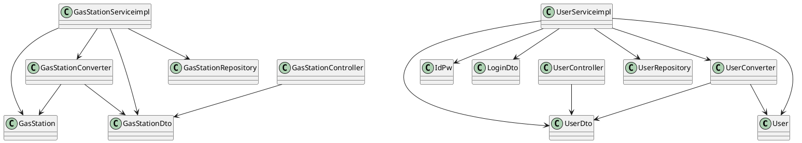

# Integration and API Test Documentation

Authors: Atabay Heydarli, Davide Lo Bianco, Gianluca Canitano, Nadir Casciola

Date: 26/5/2020

Version: 1.0

# Contents

- [Dependency graph](#dependency-graph)

- [Integration approach](#integration-approach)

- [Tests](#tests)

- [Scenarios](#scenarios)

- [Coverage of scenarios and FR](#coverage-of-scenarios-and-fr)
- [Coverage of non-functional requirements](#coverage-of-non-functional-requirements)

# Dependency graph 

     
# Integration approach

The general approach used is bottom up.
 
 Step 1: 
 * **GasStation**
 * **User**
 * **GasStationDto**
 * **UserDto**
 
 Step 2:
   * GasStation + GasStationDto + **GasStationCoverter**
   * User + UserDto + **UserConverter**

Step 3:
* GasStation + GasStationDto + GasStationConverter + **GasStationServiceimpl**
* User + UserDto + UserConverter + **UserServiceimpl**

#  Tests

## Step 1
| Classes  | JUnit test cases |
|--|--|
|GasStation|TestgetGasStationId1()|
||TestgetGasStationId2()|
||TestgetDieselPrice1()|
||TestgetDieselPrice2()|
||TestgetDieselPrice3()|
||TestgetDieselPrice4()|
||TestsetGasPrice1()|
||TestsetGasPrice2()|
||TestsetGasPrice3()|
||TestsetGasPrice4()|
||TestsetGasPrice5()|
|User|TestgetUserId1()|
||TestgetUserId2()|
||TestgetReputation1()|
||TestgetReputation2()|
||TestgetAdmin1()|
||TestgetAdmin2()|

## Step 2
| Classes  | JUnit test cases |
|--|--|
|User + UserDto + UserConverter|adminUserToDtoTest()|
||normalUserToDtoTest()|
||adminUserDtoToUserTest()|
||normalUserDtoToUserTest()|
|GasStation + GasStationDto + GasStationCoverter|gasStationToDtoTest()|
||dtoToGasStationTest()|

## Step 3 API Tests

| Classes  | JUnit test cases |
|--|--|
|User + UserDto + UserConverter + UserServiceimpl|getUserByIdExceptionTest()|
||getUserByIdNullTest()|
||getUserByIdTest()|
||getAllUsersTest()|
||getAllUsersEmptyTest()|
||deleteUserExceptionTest()|
||deleteUserTest()|
||deleteNonExistingUserTest()|
||loginSuccessfulTest()|
||loginWrongPwdTest()|
||loginWrongEmailTest()|
||increaseReputationTest()|
||increaseReputationMaximumTest()|
||decreaseReputationTest()|
||decreaseReputationMinimumTest()|
|GasStation + GasStationDto + GasStationConverter + GasStationServiceimpl|getGasStationByGasolineTypeTest1(),getGasStationByGasolineTypeTest2()|
||GasStationInvalidLatTest()|
||GasStationInvalidLonTest()|
||getGasStationByProximityTest()|
||getGasStationWithoutCoordinatesTest()|
||getGasStationWithoutCoordinatesTest1()|
||getGasStationsWithCoordinatesTest2()|
||getGasStationsWithCoordinatesTest3()|
||setReportTest1(),setReportTest2()|
||getGasStationByIdNullTest()|
||getGasStationByIdExceptionTest()|
||getAllGasStationsEmptyTest()|
||getAllGasStationsTest()|
||getCarSharingTest()|
||saveGasStationTest1()|
||getGasStationByIdTest()|
||deleteGasStationTest()|

# Scenarios

## Scenario UC1.1

| Scenario | A user without an account creates an account |
| ------------- |:-------------:| 
|  Precondition     | Account U doesn't exist |
|  Post condition   | Account U is created  |
| Step#        | Description  |
|  1     |  The user fills all the necessary elements for creating the new account |
|  2     |  The system checks whether all the necessary elements are filled, and if everthing is okay, the new account is created |

## Scenario UC1.2

| Scenario | A user tries to create a secondary account|
| ------------- |:-------------:| 
|  Precondition     | Account U already exists |
|  Post condition     | - |
| Step#        | Description  |
|  1     |  The user which already has an acoount with email and attempts to create another one using the same email | 
|  2     |  The second attempt is declined by the system |

## Scenario UC1.3

| Scenario | Administrator account is created |
| ------------- |:-------------:| 
|  Precondition     | Administrator account A may or may not exist |
|  Post condition   | A new administrator account is created |
| Step#  | Description  |
|  1     |  The necessary fields of an account are filled, and if the rules comply, the account is created |  

# Coverage of Scenarios and FR

| Scenario ID | Functional Requirements covered | JUnit  Test(s) | 
| ----------- | ------------------------------- | ----------- | 
|  10.1         | FR5.3, FR1.4, FR1.1                             |   getGasStationByIdTest()          |
|          |                                 |    getUserByIdTest()         |
|          |                                 |      increaseReputationTest()       |             
|  10.2        | FR5.3, FR1.4, FR1.1                             |     getGasStationByIdTest()        |             
|          |                                 |       getUserByIdTest()      |             
|         |                                 |          decreaseReputationTest()   |             

# Coverage of Non Functional Requirements

<Report in the following table the coverage of the Non Functional Requirements of the application - only those that can be tested with automated testing frameworks.>

### 

| Non Functional Requirement | Test name |
| -------------------------- | --------- |
| NFR2-Performance           | EZGasApplicationTests.java- NFR2_TestgetGasStationId();NFR2_TestgetDieselPrice();NFR2_TestsetGasPrice();NFR2_TestgetUserId();NFR2_TestgetReputation();NFR2_TestgetAdmin()          |
|                            | UserServiceimplTests.java -  testNFRListUsers();testNFRAddModifyUser();testNFRPermissions()           |
|                            | GasStationConverterTests.java - NFR2_gasStationToDtoTest();NFR2_DtotogasStationTest()         |
|                            | UserConverterTests.java - NFR2_normalUserDtoToUserTest();NFR2_adminUserDtoToUserTest();NFR2_normalUserToDtoTest();NFR2_adminUserToDtoTest()           |
|                            | GasStationServiceimplTest.java - testNFRAddModifyStation();testNFRListGasStations();testNFRSearchGasStation();testNFRSearchGasStation2();testNFRAddReport();testNFREvaluateReport()          |

