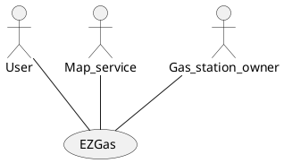

# Requirements Document 

Authors:

Date:

Version:

# Contents

- [Stakeholders](#stakeholders)
- [Context Diagram and interfaces](#context-diagram-and-interfaces)
	+ [Context Diagram](#context-diagram)
	+ [Interfaces](#interfaces) 
	
- [Stories and personas](#stories-and-personas)
- [Functional and non functional requirements](#functional-and-non-functional-requirements)
	+ [Functional Requirements](#functional-requirements)
	+ [Non functional requirements](#non-functional-requirements)
- [Use case diagram and use cases](#use-case-diagram-and-use-cases)
	+ [Use case diagram](#use-case-diagram)
	+ [Use cases](#use-cases)
    	+ [Relevant scenarios](#relevant-scenarios)
- [Glossary](#glossary)
- [System design](#system-design)
- [Deployment diagram](#deployment-diagram)

# Stakeholders

| Stakeholder name  | Description | 
| ----------------- |:-----------:|
| User  | Uses EZGas to get information about gas stations and their prices |
| Gas station owner | Keeps the prices of his gas station updated |
| Developer | Develops the application |
| Map service | Third-party map service that provides the map | 

# Context Diagram and interfaces

## Context Diagram

## Interfaces

| Actor | Logical Interface | Physical Interface  |
| ------------- |:-------------:| -----:|
| User | GUI | Touch screen, mouse, keyboard |
| Map service | API | Internet |
| Gas station owner | GUI | Touch screen, mouse, keyboard |

# Stories and personas

Tony is driving is car and he is in a rush. He notices that he is running out of gas; he quickly opens up EZGas on his phone and looks for the nearest gas station to refill his car.

John is a big money saver. He needs to refill his car and uses EZGas to look for the cheapest gas station near him.

David is a gas station owner. He signs up to EZGas to keep the prices of his gas station updated, so to give more visibility to his business. EZGas also lets him check what prices the others gas stations are offering.

Barney is planning a long roadtrip. By using EZGas, he is able to see in advance the gas stations he will find along the road.

# Functional and non functional requirements

## Functional Requirements

| ID        | Description  |
| ------------- |:-------------:| 
|  FR1     | User should be able to log in |
|  FR2     | Display a map of an area with the gas stations marked |
| FR3 | Display a list of the nearest gas stations to the user |
| FR4 | Display a list of the cheapest gas stations within a given distance |
| FR5 | Given a route, display the gas stations present along that route |
| FR6 | User should be able to sign up as a gas station owner |
| FR7 | Gas station owner can update the prices of his station |
| FR8 | User can report as wrong a price of a gas station |
| FR9 | Following a user report, the owner receives a notification |
| FR10 | User can add a gas station to the system |
| FR11 | User can modify the prices of a gas station, if that gas station has not yet been claimed |
| FR12 | User should be able to log out |

## Non Functional Requirements

| ID        | Type (efficiency, reliability, ..)           | Description  | Refers to |
| ------------- |:-------------:| :-----:| -----:|
|  NFR1     |  Usability | EZGas should require no training to be used by any user | All FR |
|  NFR2     | Performance | All functions should complete in < 2 sec | All FR |
|  NFR3     | Portability | EZGas should be accessed by web browser | All FR |

# Use case diagram and use cases

## Use case diagram
\<define here UML Use case diagram UCD summarizing all use cases, and their relationships>

### Use case 1, UC1 - FR1:	Log in
| Actors Involved        | User |
| ------------- |:-------------:| 
|  Precondition     | The user is logged out |  
|  Post condition     | The user is logged in |
|  Nominal Scenario     | The user inputs the email and the password and submits |
|  Variants     | If the combination user/password is wrong, the login window is shown again |

### Use case 2, UC2 - FR2:	Display a map of an area with the gas stations marked
| Actors Involved        | User, Map service |
| ------------- |:-------------:| 
|  Precondition     | The GPS is able to locate the user |  
|  Post condition     | A map of the user's location is shown, with the gas stations marked |
|  Nominal Scenario     | EZgas gets the location from the GPS, loads the map, overlays the map with the gas stations present, and displays it |
|  Variants     | Shows error if the GPS is not able to locate the user, or if the map service itself throws an error |

### Use case 3, UC3 - FR3:	Display a list of the nearest gas stations to the user
| Actors Involved        | User |
| ------------- |:-------------:| 
|  Precondition     | The GPS is able to locate the user |  
|  Post condition     | A list of the nearest gas stations is displayed |
|  Nominal Scenario     | EZGas get the user location, calculates the nearest stations and displays them |
|  Variants     | Shows error if the GPS is not able to locate the user |

### Use case 4, UC4 - FR4: Display a list of the cheapest gas stations within a given distance
| Actors Involved        | User |
| ------------- |:-------------:| 
|  Precondition     | The GPS is able to locate the user |  
|  Post condition     | A list of the cheapest gas stations is displayed |
|  Nominal Scenario     | EZGas gets the user location and the range, finds all the gas stations within that range and displays them from cheapest to most expensive |
|  Variants     | Shows error if the GPS is not able to locate the user |

### Use case 5, UC5 - FR5:	Given a route, display the gas stations present along that route
| Actors Involved        | User |
| ------------- |:-------------:| 
|  Precondition     | The given route is valid |  
|  Post condition     | A list of the gas stations present along the route is shown |
|  Nominal Scenario     | The user inputs the starting point and the destination point, EZGas finds and displays the gas stations present along the road |
|  Variants     | Shows error if the route given by the user is not valid |

### Use case 1, UC1 - FR1:	Log in
| Actors Involved        |  |
| ------------- |:-------------:| 
|  Precondition     | \<Boolean expression, must evaluate to true before the UC can start> |  
|  Post condition     | \<Boolean expression, must evaluate to true after UC is finished> |
|  Nominal Scenario     | \<Textual description of actions executed by the UC> |
|  Variants     | \<other executions, ex in case of errors> |

##### Scenario 1.1 

\<describe here scenarios instances of UC1>

\<a scenario is a sequence of steps that corresponds to a particular execution of one use case>

\<a scenario is a more formal description of a story>

\<only relevant scenarios should be described>

| Scenario 1.1 | |
| ------------- |:-------------:| 
|  Precondition     | \<Boolean expression, must evaluate to true before the scenario can start> |
|  Post condition     | \<Boolean expression, must evaluate to true after scenario is finished> |
| Step#        | Description  |
|  1     |  |  
|  2     |  |
|  ...     |  |

##### Scenario 1.2

### Use case 2, UC2
..

### Use case
..

# Glossary

\<use UML class diagram to define important concepts in the domain of the system, and their relationships> 

\<concepts are used consistently all over the document, ex in use cases, requirements etc>

# System Design
\<describe here system design>

\<must be consistent with Context diagram>

# Deployment Diagram 

\<describe here deployment diagram >
