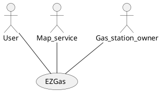
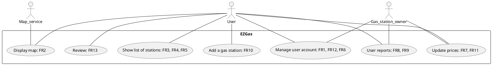
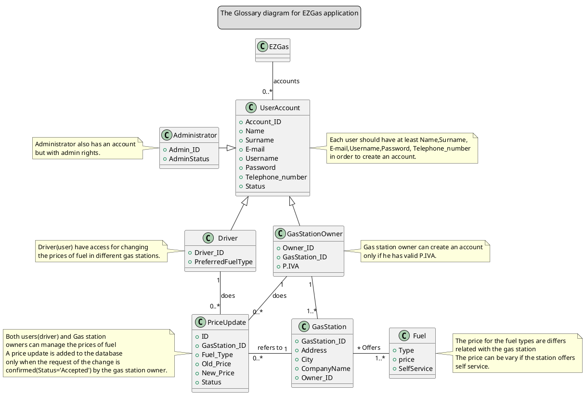
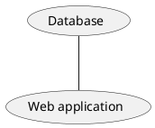

# Requirements Document 

Authors: Atabay Heydarli, Davide Lo Bianco, Gianluca Canitano, Nadir Casciola

Date: 19/04/2020

Version: 1.0

# Contents

- [Stakeholders](#stakeholders)
- [Context Diagram and interfaces](#context-diagram-and-interfaces)
	+ [Context Diagram](#context-diagram)
	+ [Interfaces](#interfaces) 
	
- [Stories and personas](#stories-and-personas)
- [Functional and non functional requirements](#functional-and-non-functional-requirements)
	+ [Functional Requirements](#functional-requirements)
	+ [Non functional requirements](#non-functional-requirements)
- [Use case diagram and use cases](#use-case-diagram-and-use-cases)
	+ [Use case diagram](#use-case-diagram)
	+ [Use cases and relevant scenarios](#Use-cases-and-relevant-scenarios)
- [Glossary](#glossary)
- [System design](#system-design)
- [Deployment diagram](#deployment-diagram)

# Stakeholders

| Stakeholder name  | Description | 
| ----------------- |:-----------:|
| User  | Uses EZGas to get information about gas stations and their prices |
| Gas station owner | Keeps the prices of his gas station updated |
| Developer | Develops the application |
| Map service | Third-party map service that provides the map | 

# Context Diagram and interfaces

## Context Diagram

## Interfaces

| Actor | Logical Interface | Physical Interface  |
| ------------- |:-------------:| -----:|
| User | GUI | Touch screen, mouse, keyboard |
| Map service | API | Internet |
| Gas station owner | GUI | Touch screen, mouse, keyboard |

# Stories and personas

Tony is driving is car and he is in a rush. He notices that he is running out of gas; he quickly opens up EZGas on his phone and looks for the nearest gas station to refill his car.

John is a big money saver. He needs to refill his car and uses EZGas to look for the cheapest gas station near him.

David is a gas station owner. He signs up to EZGas to keep the prices of his gas station updated, so to give more visibility to his business. EZGas also lets him check what prices the others gas stations are offering.

Barney is planning a long roadtrip. By using EZGas, he is able to see in advance the gas stations he will find along the road.

# Functional and non functional requirements

## Functional Requirements

| ID        | Description  |
| ------------- |:-------------:| 
|  FR1     | User should be able to log in |
|  FR2     | Display a map of an area with the gas stations marked |
| FR3 | Display a list of the nearest gas stations to the user |
| FR4 | Display a list of the cheapest gas stations within a given distance |
| FR5 | Given a route, display the gas stations present along that route |
| FR6 | User should be able to sign up as a gas station owner |
| FR7 | Gas station owner can update the prices of his station |
| FR8 | User can report as wrong a price of a gas station |
| FR9 | Following a user report, the owner receives a notification |
| FR10 | User can add a gas station to the system |
| FR11 | User can modify the prices of a gas station, if that gas station has not yet been claimed |
| FR12 | User should be able to log out |
| FR13 | User can write a review of a gas station |

## Non Functional Requirements

| ID        | Type (efficiency, reliability, ..)           | Description  | Refers to |
| ------------- |:-------------:| :-----:| -----:|
|  NFR1     |  Usability | EZGas should require no training to be used by any user | All FR |
|  NFR2     | Performance | All functions should complete in < 2 sec | All FR |
|  NFR3     | Portability | EZGas should be accessed by web browser | All FR |

# Use case diagram and use cases

## Use case diagram

# Use cases and relevant scenarios

### Use case 1, UC1 - FR1:	Log in
| Actors Involved        | User |
| ------------- |:-------------:| 
|  Precondition     | The user is logged out |  
|  Post condition     | The user is logged in |
|  Nominal Scenario     | The user inputs the email and the password and submits |
|  Variants     | If the combination user/password is wrong, the login window is shown again |

### Use case 2, UC2 - FR2:	Display a map of an area with the gas stations marked
| Actors Involved        | User, Map service |
| ------------- |:-------------:| 
|  Precondition     | The GPS is able to locate the user |  
|  Post condition     | A map of the user's location is shown, with the gas stations marked |
|  Nominal Scenario     | EZgas gets the location from the GPS, loads the map, overlays the map with the gas stations present, and displays it |
|  Variants     | Shows error if the GPS is not able to locate the user, or if the map service itself throws an error |

##### Scenario 2.1 

| Scenario 2.1 | Corresponds to UC2 |
| ------------- |:-------------:| 
|  Precondition     | The GPS is able to locate the user |
|  Post condition     | A map of the user's location is shown, with the gas stations marked |
| Step#        | Description  |
|  1     | Get the location of the user |  
|  2     | Get the map of that location from the map service  |
|  3  | Calculate which gas stations are inside the area of the map |
|  4 | Draw a symbol of each gas station over the map |
|  5  | Display the map to the user |

### Use case 3, UC3 - FR3:	Display a list of the nearest gas stations to the user
| Actors Involved        | User |
| ------------- |:-------------:| 
|  Precondition     | The GPS is able to locate the user |  
|  Post condition     | A list of the nearest gas stations is displayed |
|  Nominal Scenario     | EZGas get the user location, calculates the nearest stations and displays them |
|  Variants     | Shows error if the GPS is not able to locate the user |

### Use case 4, UC4 - FR4: Display a list of the cheapest gas stations within a given distance
| Actors Involved        | User |
| ------------- |:-------------:| 
|  Precondition     | The GPS is able to locate the user |  
|  Post condition     | A list of the cheapest gas stations is displayed |
|  Nominal Scenario     | EZGas gets the user location and the range, finds all the gas stations within that range and displays them from cheapest to most expensive |
|  Variants     | Shows error if the GPS is not able to locate the user |

### Use case 5, UC5 - FR5:	Given a route, display the gas stations present along that route
| Actors Involved        | User |
| ------------- |:-------------:| 
|  Precondition     | The given route is valid |  
|  Post condition     | A list of the gas stations present along the route is shown |
|  Nominal Scenario     | The user inputs the starting point and the destination point, EZGas finds and displays the gas stations present along the road |
|  Variants     | Shows error if the route given by the user is not valid |

### Use case 6, UC6 - FR6:	User should be able to sign up as a gas station owner
| Actors Involved        | User, Gas station owner |
| ------------- |:-------------:| 
|  Precondition     | User is not already a gas station owner |  
|  Post condition     | User is a gas station owner |
|  Nominal Scenario     | User inputs the data about the gas station he owns, EZGas registers him as a gas station owner |
|  Variants     | If the user is already a gas station owner, displays an error |

### Use case 7, UC7 - FR7:	Gas station owner can update the prices of his station
| Actors Involved        | Gas station owner |
| ------------- |:-------------:| 
|  Precondition     | The gas station is registered as owned by the gas station owner |  
|  Post condition     | The gas station's prices are updated |
|  Nominal Scenario     | Gas station owner inputs the new prices, the new prices are now shown |
|  Variants     | If the gas station owner doesn't own the station, it shows error |

### Use case 8, UC8 - FR8, FR9: User reports a wrong price
| Actors Involved        | User |
| ------------- |:-------------:| 
|  Precondition     | The gas station has already been claimed by a station owner |  
|  Post condition     | The gas station owner receives a notification |
|  Nominal Scenario     | User reports the gas station's prices, the owner receives a notifiation |
|  Variants     | If the gas station hasn't been claimed, the user can't report it, but he can update the prices (FR11) |

### Use case 9, UC9 - FR10:	User can add a gas station to the system
| Actors Involved        | User |
| ------------- |:-------------:| 
|  Precondition     | The gas station the user is trying to add isn't already in EZGas |  
|  Post condition     | The gas station is now added to EZGas |
|  Nominal Scenario     | User inputs the data about the gas station, the gas station is added to the system |
|  Variants     | If the gas station is already in the system, it shows an error |

### Use case 10, UC10 - FR11:	User can modify the prices of a gas station
| Actors Involved        | User |
| ------------- |:-------------:| 
|  Precondition     | The gas station hasn't been claimed by an owner yet |  
|  Post condition     | The gas station's prices are updated |
|  Nominal Scenario     | The user selects the gas station, inputs the new prices, the system is updated |
|  Variants     | If the gas station has already been claimed, it tells the user that he can send a report (FR8, FR9) |

##### Scenario 10.1 

| Scenario 10.1 | Corresponds to UC10 |
| ------------- |:-------------:| 
|  Precondition     | The gas station hasn't been claimed by an owner yet |
|  Post condition     | The gas station's prices are updated |
| Step#        | Description  |
|  1     | User selects which station to update |  
|  2     | The system verifies that the station has not been claimed |
|  3     | The user inputs the new prices |
|  4     | The system updates the station's prices |

### Use case 11, UC11 - FR12:	User should be able to log out
| Actors Involved        | User |
| ------------- |:-------------:| 
|  Precondition     | User is logged in |  
|  Post condition     | User is logged out |
|  Nominal Scenario     | The user clicks on the log out button and he is logged out |
|  Variants     |  |

### Use case 12, UC12 - FR13:	User can write a review of a gas station
| Actors Involved        | User |
| ------------- |:-------------:| 
|  Precondition     | The gas station is in the system |  
|  Post condition     | A new review is added to the gas station |
|  Nominal Scenario     | The user writes a review, and it is added to the station |
|  Variants     | If the gas station doesn't exist in the system, it shows an error |

# Glossary

# System Design

# Deployment Diagram 

\<describe here deployment diagram >
